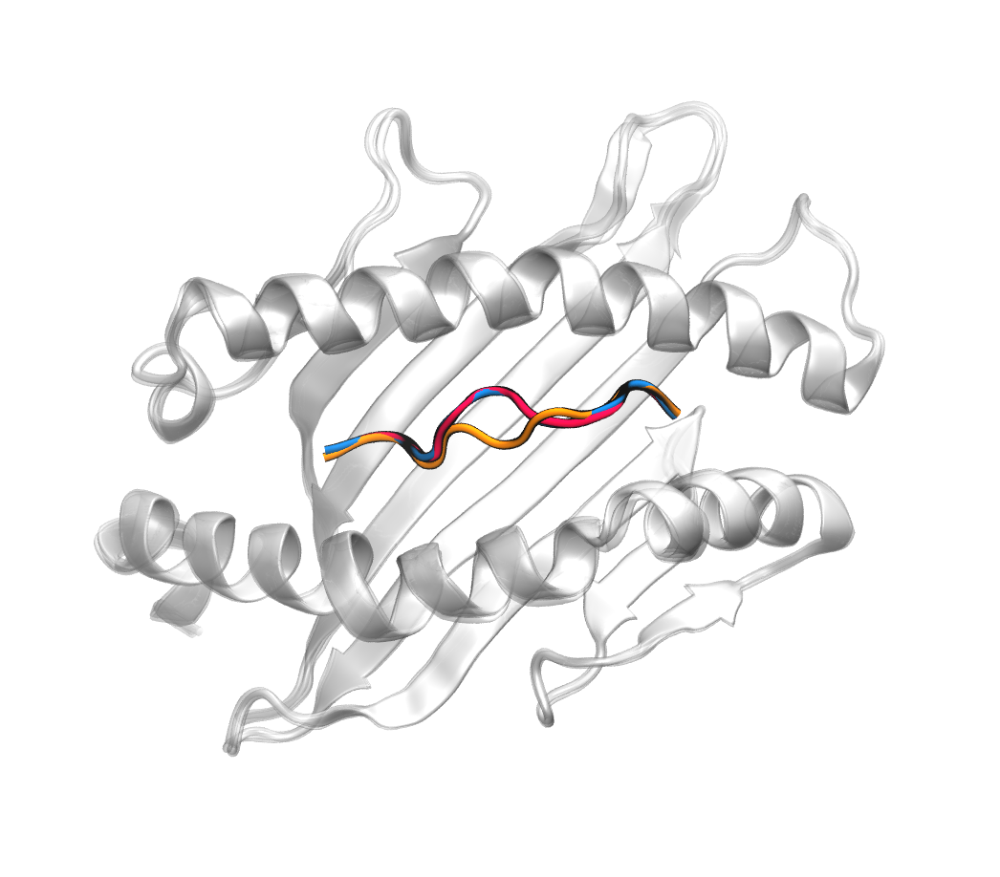

*Figure: Comparative Visualization of pMHC Complex Prediction Accuracy. True peptide structure in red, Pandora model in orange, MHC-Fine (fine-tuned AlphaFold) in blue. High precision of MHC-Fine (RMSD: 0.25 Å) versus Pandora (RMSD: 1.44 Å) for PDB ID: 6vb3.*

# MHC-Fine

The precise prediction of Major Histocompatibility Complex (MHC)-peptide complex structures is pivotal for understanding cellular immune responses and advancing vaccine design. In this study, we enhanced AlphaFold's capabilities by fine-tuning it with a specialized dataset comprised by exclusively high-resolution MHC-peptide crystal structures. This tailored approach aimed to address the generalist nature of AlphaFold's original training, which, while broad-ranging, lacked the granularity necessary for the high-precision demands of MHC-peptide interaction prediction. A comparative analysis was conducted against the homology-modeling-based method Pandora, as well as the AlphaFold multimer model. Our results demonstrate that our fine-tuned model outperforms both in terms of RMSD (median value is 0.65 Å) but also provides enhanced predicted lDDT scores, offering a more reliable assessment of the predicted structures. These advances have substantial implications for computational immunology, potentially accelerating the development of novel therapeutics and vaccines by providing a more precise computational lens through which to view MHC-peptide interactions.

# Pretrained Model

You can download the latest version of the model from Google drive: [link](https://drive.google.com/file/d/1gz8uF8DKE0CzyX_WeDGOX7xP69LjpaZT/view?usp=sharing)

# Installation

All required libraries will be installed in the notebook [Inference.ipynb](./Inference.ipynb).

# Inference

To run inference, you need:

- protein sequence
- peptide sequence: length 8 to 11
- unique id: name for the sample

We prepared a Colab notebook which you can use:

